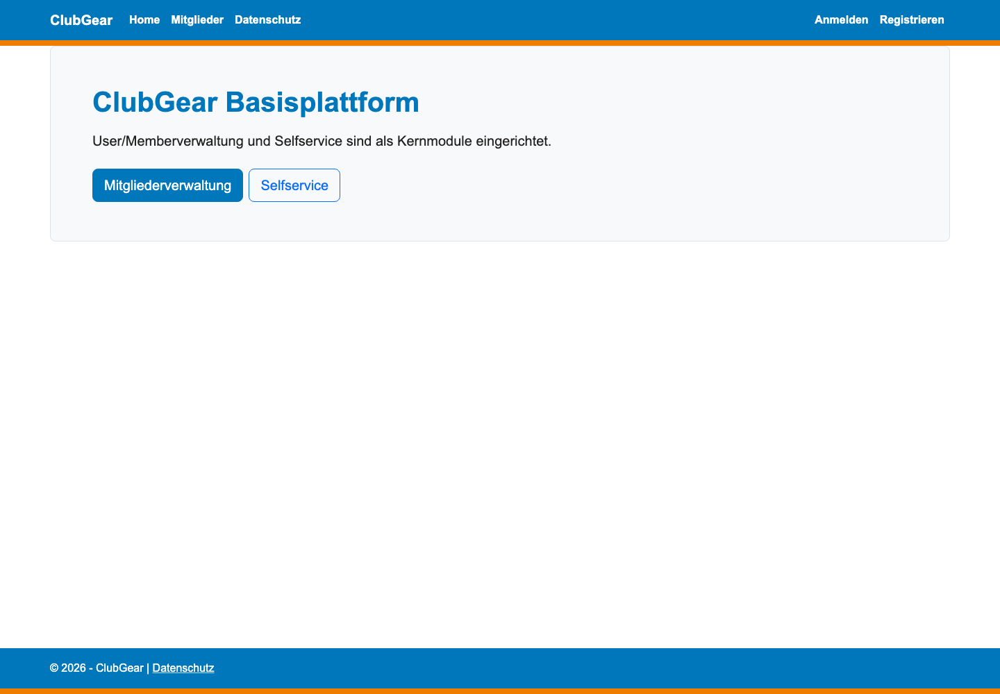
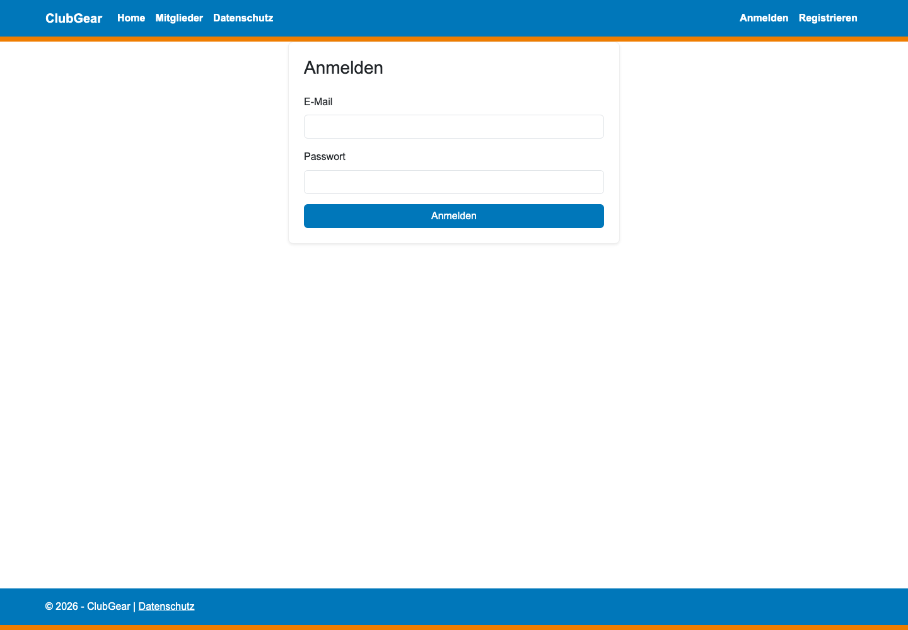
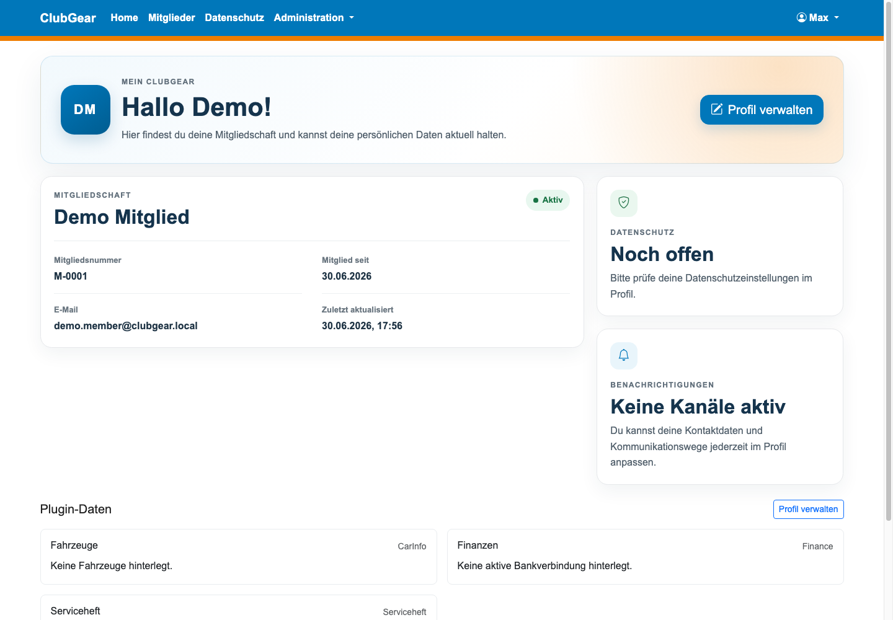
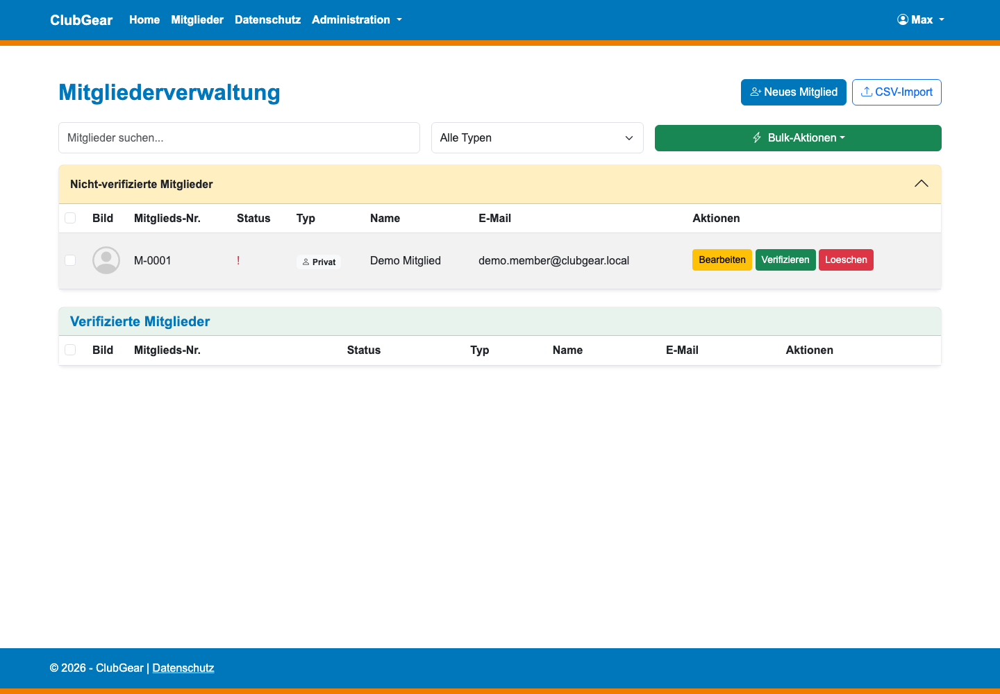
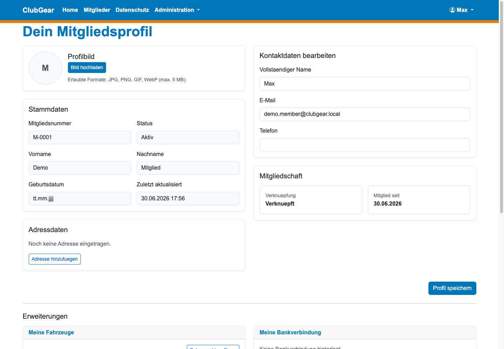
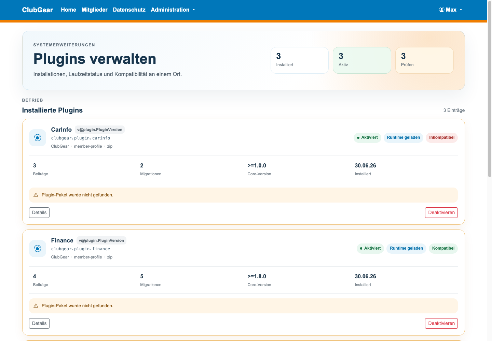
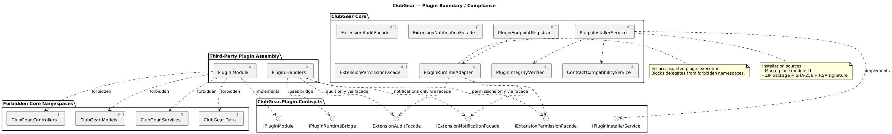

# ClubGear

ClubGear is a modular club-management platform built with ASP.NET Core MVC. It provides a core application for members, roles, permissions, self-service workflows, notifications, auditing, and administration, and it can be extended through contract-based plugins.

The project is designed as a single deployable web application rather than a microservice system. The core stays responsible for identity, data ownership, runtime hosting, and operational controls, while plugins contribute focused features through explicit contracts and extension points.



## What ClubGear Does

ClubGear helps clubs manage their operational data in one place:

- Member administration with list, edit, import, verification, and deletion flows.
- Member self-service so authenticated members can maintain their own profile data.
- Role and permission management backed by database-stored permissions.
- Audit and event logging for business changes and operational diagnostics.
- Email and in-app notification infrastructure, with optional external notification channels.
- External login support through configurable OpenID Connect providers.
- A plugin runtime for member-profile, general-extension, and technical plugins.
- Plugin package installation, activation, lifecycle status, compatibility checks, and signature/hash artifacts.

## Screenshots

The following screenshots were captured from the local development profile on `http://localhost:5007`.



### Authenticated Member Area



### Member Management



### Self-Service Profile



### Plugin Administration



## Architecture

ClubGear is an ASP.NET Core 8 MVC monolith with Razor views, EF Core, SQLite, ASP.NET Core Identity, Bootstrap, and xUnit architecture tests.


At runtime, browser requests enter MVC and API controllers, flow through feature services, and persist state through EF Core. The application seeds its own schema and compatibility patches during startup instead of relying on a traditional EF migrations folder.

```text
Browser
  -> ASP.NET Core MVC and API controllers
  -> Feature services and core services
  -> EF Core
  -> SQLite database
```

## Plugin Model

Plugins are hosted through a contract-first boundary. A plugin should depend on `ClubGear.Plugin.Contracts` and contribute features through explicit extension points instead of referencing core implementation namespaces directly.



The repository currently contains these plugin examples:

| Plugin | Category | Purpose |
|---|---|---|
| `CarInfo` | `member-profile` | Vehicle information on member profiles and self-service pages. |
| `Serviceheft` | `member-profile` | Service-book data that depends on the car information plugin. |
| `Finance` | `member-profile` | Member bank details, SEPA reference data, and finance-specific pages. |
| `Inventar` | `general-extension` | Inventory pages and admin functions. |

Plugin packages are distributed as ZIP files containing a manifest and the built plugin assembly. Packaging scripts can emit checksums and signature files so the host can verify installed packages.

## Repository Layout

| Path | Description |
|---|---|
| `Program.cs` | Application startup, middleware pipeline, seeding, and plugin activation. |
| `Controllers/` | MVC and API controllers for account, members, admin, plugins, and self-service. |
| `Services/` | Core services, authorization, notification, plugin runtime, and persistence logic. |
| `Models/` | Core domain and view models. |
| `Views/` | Razor views and partials. |
| `Contracts/Plugin/` | Public plugin contracts used by plugin assemblies. |
| `plugins/` | Plugin implementations and their manifests. |
| `tests/ClubGear.ArchitectureTests/` | Architecture, plugin-boundary, and focused behavior tests. |
| `docs/architecture/` | Architecture documentation and rendered diagrams. |
| `scripts/` | Plugin packaging and activation-value utilities. |

## Local Development

Requirements:

- .NET SDK 8.
- SQLite, provided through EF Core SQLite packages.
- A shell capable of running the repository scripts.

Run the application:

```bash
dotnet run --launch-profile http
```

The development profile serves the app at:

```text
http://localhost:5007
```

Development settings live in `appsettings.Development.json`. By default the development database is `clubmanagerv0_2.dev.db`, and local email delivery uses the pickup directory configured under `App_Data/MailDrop`.

## Testing

Run the architecture test project:

```bash
dotnet test tests/ClubGear.ArchitectureTests/ClubGear.ArchitectureTests.csproj
```

For targeted plugin or boundary work, prefer running the focused test classes in `tests/ClubGear.ArchitectureTests/` and keep plugin-specific behavior inside plugin projects unless a core contract change is explicitly required.

## Deployment

ClubGear can run directly with `dotnet run` or as a container image. The repository includes:

- `Dockerfile` for a multi-stage .NET build.
- `docker-compose.yml` for local/container deployment.
- `deploy.sh` and `build-and-export.sh` for project-specific deployment workflows.

See `docs/architecture/runtime-deployment.md` for the detailed runtime and deployment notes.

## Further Reading

- [System Overview](docs/architecture/system-overview.md)
- [Core Deep Dive](docs/architecture/core-deep-dive.md)
- [Runtime and Deployment](docs/architecture/runtime-deployment.md)
- [Plugin Authoring Guide](docs/architecture/plugin-authoring-guide.md)
- [Plugin Boundary and Compliance](docs/architecture/plugin-boundary-and-compliance.md)
