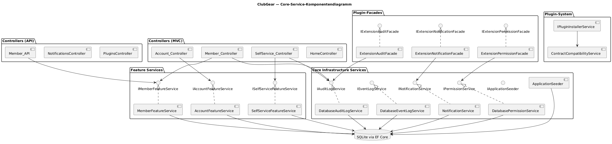
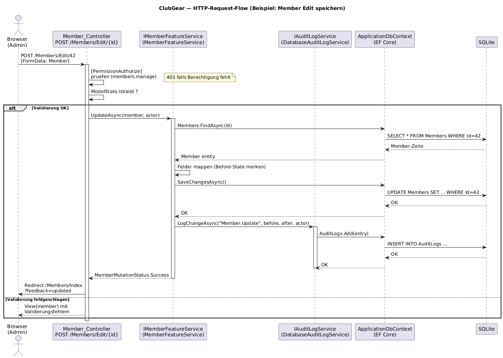

# Core Deep Dive

Audience: Entwickler, Architekten
Scope: Alle Core-Services, Feature-Services, Plugin-Facades und das Berechtigungssystem
Last-Validated: 2026-07-09
Source-Commit: working-tree docs refresh
Related-Diagrams: diagrams/img/cmp-core-services.png, diagrams/img/seq-request-flow.png

## Purpose

Dieses Dokument beschreibt ClubGear auf Service-Komponentenebene (C4 Level 3).
Es dokumentiert Verantwortlichkeiten, Interfaces, Seiteneffekte und Controller-Touchpoints
jedes Core-Service-Moduls.

---

## Komponentenübersicht

---

## HTTP-Request-Flow (Beispiel: Member-Edit)

---

## Feature Services

Feature Services kapseln die fachliche Logik für einen Bereich.
Sie implementieren ein Interface und werden per DI injiziert.

### IMemberFeatureService / MemberFeatureService

**Datei:** `Services/Core/MemberFeatureService.cs`
**Interface:** `Services/Abstractions/IMemberFeatureService.cs`

| Methode | Beschreibung | Seiteneffekte |
|---|---|---|
| `GetListAsync(search?)` | Liefert alle aktiven Mitglieder, optional gefiltert | Keine |
| `GetInactiveAsync()` | Liefert inaktive Mitglieder | Keine |
| `GetByIdAsync(id)` | Einzelnes Mitglied per ID | Keine |
| `BuildListSegments(members)` | Segmentiert Liste in aktiv/inaktiv/spezial | Keine (pure) |
| `BuildHierarchy(members)` | Erzeugt eine flache Parent/Submember-Zeilenstruktur fuer die Mitgliederuebersicht | Keine (pure) |
| `SearchForReferenceAsync(query, limit)` | Liefert Suchtreffer fuer MemberReference-Metadatenfelder | DB-Read |
| `GetReferenceLabelsAsync(ids)` | Loest Member-Ids in lesbare Labels auf | DB-Read |
| `CreateAsync(member, actor)` | Erstellt neues Mitglied | DB-Insert + AuditLog |
| `UpdateAsync(member, actor)` | Aktualisiert Mitglied | DB-Update + AuditLog |
| `VerifyAsync(id, actor)` | Setzt `IsVerified = true` | DB-Update + AuditLog |
| `DeleteAsync(id, actor)` | Löscht Mitglied | DB-Delete + AuditLog + zugehörige Adressen via Cascade |
| `BulkDeleteAsync(ids, actor, hasPermission)` | Bulk-Löschung mit Berechtigungsprüfung | DB-Delete (mehrfach) + AuditLog |
| `ImportCsvAsync(stream, actor)` | CSV-Import (Upsert) | DB-Insert/Update + AuditLog |

**Controller-Touchpoints:** `Controllers/Member/Member_Controller.cs`, `Controllers/Member/Member_API.cs`

Die Mitgliederuebersicht nutzt `BuildHierarchy`, um Container-Mitglieder direkt mit ihren Untermitgliedern zu rendern. Die Parent/Child-Beziehung entsteht aus `MemberReference`-Metadatenwerten und `MembershipType.AllowsSubMembers`; siehe [Core Membership Hierarchy](core-membership-hierarchy.md).

---

### IAccountFeatureService / AccountFeatureService

**Datei:** `Services/Core/AccountFeatureService.cs`
**Interface:** `Services/Abstractions/IAccountFeatureService.cs`

| Methode | Beschreibung | Seiteneffekte |
|---|---|---|
| `LoginAsync(email, password)` | Authentifiziert Benutzer via ASP.NET Core Identity | Cookie-Session wird gesetzt |
| `RegisterAsync(fullName, email, password)` | Registriert neuen ApplicationUser | DB-Insert (AspNetUsers) + ggf. E-Mail-Benachrichtigung |
| `LogoutAsync()` | Meldet aktuellen Benutzer ab | Session-Cookie wird gelöscht |

**Rückgaben:** `AccountLoginOutcome` (Success/MissingCredentials/InvalidCredentials), `AccountRegistrationOutcome` (Succeeded + Errors-Liste)

**Controller-Touchpoints:** `Controllers/Account/Account_Controller.cs`, `Controllers/Account/Account_API.cs`

---

### ISelfServiceFeatureService / SelfServiceFeatureService

**Datei:** `Services/Core/SelfServiceFeatureService.cs`
**Interface:** `Services/Abstractions/ISelfServiceFeatureService.cs`

| Methode | Beschreibung | Seiteneffekte |
|---|---|---|
| `GetDashboardAsync(principal)` | Prüft Mitglieds-Verknüpfung, liefert Dashboard-Daten | Keine |
| `GetProfileAsync(principal)` | Lädt eigenes Profil | Keine |
| `UpdateProfileAsync(principal, model)` | Aktualisiert eigenes Profil | DB-Update (Member) + AuditLog |

**Challenge-Konzept:** Wenn kein Mitglied mit dem eingeloggten ApplicationUser verknüpft ist,
geben alle Methoden `RequiresChallenge = true` zurück — die View leitet zum Verknüpfungs-Dialog.

**Controller-Touchpoints:** `Controllers/SelfService/SelfService_Controller.cs`, `Controllers/SelfService/SelfService_API.cs`

**Plugin-Integration:** `SelfServiceController.Profile` reichert die Profilansicht zusaetzlich mit `IMemberPluginSlotService` an. Dadurch koennen dieselben schema-gesteuerten Plugin-Aktionen und Detail-Slots wie im Mitgliederbereich auch im Selfservice erscheinen, ohne dass SelfService-spezifische Plugin-Views im Core entstehen.

`IMemberPluginSlotService.CollectEditTabsAsync` projiziert jeden `MemberEditTabSlot` auf ein `MemberPluginEditTabView` und kopiert dabei die optionalen Properties `GroupKey` und `GroupTitle`. Die Razor-Partial `_PluginSlots.cshtml` gruppiert die Views per `GroupBy(GroupKey)` zu Bootstrap-Kaesten mit Nav-Tabs — Plugins ohne `GroupKey` erhalten je einen eigenen Kasten. Details zur Plugin-Seite: [Plugin Authoring Guide — Member-Edit-Tab-Gruppen](plugin-authoring-guide.md#4b-member-edit-tab-gruppen-groupkey--grouptitle).

---

## Core-Infrastructure-Services

### IAuditLogService / DatabaseAuditLogService + AuditSinkDispatchDecorator

**Datei:** `Services/Core/DatabaseAuditLogService.cs`, `Services/Core/AuditSinkDispatchDecorator.cs`

Persistiert Änderungshistorie in `AuditLogs`. Jeder Eintrag enthält:
- `Action` (z.B. `"Member.Update"`)
- `Actor` (Username der auslösenden Person)
- `Before`/`After` als JSON-Snapshots
- `TargetType` / `TargetId` für Referenzierbarkeit

Wird von Feature-Services nach jeder mutativen Operation aufgerufen.

`AuditSinkDispatchDecorator` umhuellt `DatabaseAuditLogService` und leitet jeden Audit-Event zusaetzlich an alle Plugin-Audit-Sinks weiter (`IPluginAuditSinkService`). Die Dispatch-Kette ist fehlertolerant — ein fehlerhafter Sink blockiert nicht das Core-Audit-Log. DI-Wiring: Singleton-Decorator in `ServiceCollectionExtensions`.

### IEventLogService / DatabaseEventLogService

**Datei:** `Services/Core/DatabaseEventLogService.cs`

Persistiert technische Systemereignisse in `SystemEventLogs`. Trennung von AuditLog
(fachlich) vs. EventLog (technisch/operational). Beinhaltet HTTP-Kontext-Infos
(Path, Method, RequestId).

### INotificationService / NotificationService

**Datei:** `Services/Core/NotificationService.cs`

Versendet Benachrichtigungen über konfigurierbare `INotificationChannel`-Implementierungen.
Aktuell unterstützte Kanäle: E-Mail (SMTP), Matrix (optional).

Nachrichten werden vor dem Versand in `NotificationRecords` mit `Status = "Queued"` gespeichert
und nach Versand auf `"Sent"` oder `"Failed"` aktualisiert.

`IMessageComposer` / `ITemplateRenderer` werden genutzt, um HTML-Templates zu rendern.

### IPluginAuditSinkService / PluginAuditSinkService

**Datei:** `Services/Plugins/AuditSink/PluginAuditSinkService.cs`

Dispatcht einen `PluginAuditEvent` an alle `IAuditSinkProvider`-Implementierungen, die von aktiven Plugins contributed wurden. Jeder Sink wird isoliert aufgerufen — Exceptions werden geloggt und ignoriert, um den Core-Audit-Flow nicht zu unterbrechen.

### IPluginBackgroundJobRunner / PluginBackgroundJobRunner

**Datei:** `Services/Plugins/Runtime/PluginBackgroundJobRunner.cs`

Singleton-Service, der Background-Job-Contributions technischer Plugins startet und stoppt.

- **Start:** Wird von `PluginLifecycleService` nach `Register` aufgerufen. Loedt den Job-Typ aus dem Plugin-ALC, erstellt einen `CancellationTokenSource` pro Modul, startet fire-and-forget Tasks via `IServiceScopeFactory`.
- **Stop:** Wird vor `Unregister` aufgerufen. Signalisiert Abbruch und wartet max. 5 Sekunden auf den Drain (verhindert ALC-Unload-Race).
- **Status:** `GetJobStatuses(moduleId)` liefert `PluginJobStatus`-Records mit `State` (`Idle`, `Running`, `Faulted`, `Cancelled`, `Stopped`), `LastRunUtc` und `LastError`.

Laufzeitstatus ist in der Plugin-Admin-Detailansicht (`/PluginAdmin/Detail/{key}`) sichtbar.

### IExternalLoginConfigService / ExternalLoginConfigService

**Datei:** `Services/ExternalLogin/ExternalLoginConfigService.cs`

Liest und schreibt OIDC-Provider-Konfiguration in `SystemConfigEntry`-Zeilen unter `Section = "externallogin.{providerKey}"`. Schluessel: `authority`, `clientid`, `clientsecret`, `active`.

Methoden: `GetProviderAsync`, `SaveProviderAsync`, `ListProvidersAsync`, `GetActiveProvidersAsync`, `TestConnectionAsync`.

### IExternalLoginService / ExternalLoginService

**Datei:** `Services/ExternalLogin/ExternalLoginService.cs`

Verwaltet den OIDC-Challenge/Callback-Flow:
- `ChallengeAsync` — gibt eine `ChallengeResult`-Redirect-URL zum konfigurierten OIDC-Provider zurueck
- `HandleCallbackAsync` — verarbeitet den OIDC-Callback, ruft `IIdpClaimsEnricher` auf, verknuepft oder erstellt `Member` via `OauthID`-Unique-Key, gibt `ExternalLoginOutcome` zurueck

### IIdpClaimsEnricher / IdpClaimsEnricher

**Datei:** `Services/ExternalLogin/IdpClaimsEnricher.cs`

Iteriert alle `IIdentityProviderPlugin`-Contributions aktiver Plugins und ruft `MapClaimsAsync` auf. Jedes Plugin kann den Login-Kontext mit Custom-Claims anreichern. Fehler werden per Sink-Muster isoliert.

### OidcOptionsReloader

**Datei:** `Services/ExternalLogin/OidcOptionsReloader.cs`

`IConfigureNamedOptions<OpenIdConnectOptions>` — liest `authority`, `clientid`, `clientsecret` aus `SystemConfigEntry` und schreibt sie zur Request-Zeit in die OIDC-Handler-Options. Ermoeglicht Aenderung der OIDC-Konfiguration ohne App-Neustart. Das OIDC-Scheme `"oidc.generic"` wird bei App-Start mit Platzhalter-Werten registriert und erst zur Laufzeit durch diesen Reloader befuellt.

### IPermissionService / DatabasePermissionService

**Datei:** `Services/Authorization/DatabasePermissionService.cs`

Prüft ob eine Rolle eine bestimmte Permission hat (`HasPermissionAsync(role, key)`).
Permissions werden in `AppPermissions` und Rollenzuweisungen in `AppRolePermissions` gespeichert.
Der `[PermissionAuthorize(PermissionKeys.XXX)]`-Attribute-Wrapper nutzt diesen Service.

### IApplicationSeeder / ApplicationSeeder

**Datei:** `Services/Core/ApplicationSeeder.cs`

Zentraler Startup-Service — führt beim ersten Start aus:
1. `EnsureCreatedAsync()` — Schema-Erstellung
2. `EnsureSqliteSchemaCompatibilityAsync()` — Legacy-Patches für ClubManager-Altdaten
3. Alle registrierten `ISeedTask`-Implementierungen (geordnet nach `Order`)

Mehr Details: [Runtime & Deployment](runtime-deployment.md) + [Data Model & Migrations](data-model-and-migrations.md)

---

## Plugin-Facades

Plugins dürfen **nicht direkt** auf `ApplicationDbContext` oder Feature-Services zugreifen.
Stattdessen erhalten sie drei dedizierte Facades:

| Facade | Interface | Erlaubt |
|---|---|---|
| `ExtensionAuditFacade` | `IExtensionAuditFacade` | Audit-Log-Einträge schreiben |
| `ExtensionNotificationFacade` | `IExtensionNotificationFacade` | Notifications versenden |
| `ExtensionPermissionFacade` | `IExtensionPermissionFacade` | Berechtigungen abfragen |

Mehr Details: [Plugin Boundary & Compliance](plugin-boundary-and-compliance.md)

---

## Berechtigungssystem

### Rollen

| Rollenname | Konstante | Zweck |
|---|---|---|
| `ClubGear.Admin` | `RoleNames.Admin` | Voller Zugriff (inkl. `*`-Wildcard-Permission) |
| `ClubGear.MemberManager` | `RoleNames.MemberManager` | Mitgliederverwaltung |
| `ClubGear.MemberSelfService` | `RoleNames.MemberSelfService` | Selfservice-Zugriff |

### Permissions

| Permission-Key | Konstante | Beschreibung |
|---|---|---|
| `*` | `PermissionKeys.Wildcard` | Voller Zugriff (Admin-Wildcard) |
| `admin.access` | `PermissionKeys.AdminAccess` | Admin-Bereich |
| `members.read` | `PermissionKeys.MembersRead` | Mitglieder ansehen |
| `members.manage` | `PermissionKeys.MembersManage` | Mitglieder erstellen/bearbeiten/löschen |
| `selfservice.access` | `PermissionKeys.SelfServiceAccess` | Selfservice-Portal betreten |
| `selfservice.profile.edit` | `PermissionKeys.SelfServiceProfileEdit` | Eigenes Profil bearbeiten |

Seed-Daten werden via `CorePermissionDefinitionProvider` + zugehörigem `ISeedTask` beim Start eingespielt.

---

## Middleware

### GlobalExceptionMiddleware

**Datei:** `Middleware/GlobalExceptionMiddleware.cs`

Fängt alle unbehandelten Exceptions ab, loggt sie via `IEventLogService`
und gibt eine user-friendly Fehlerseite zurück (kein Stack-Trace im Browser).
Liegt in der Pipeline **nach** Auth/Authorization.

---

## Open Questions
- `IContractCompatibilityService`: Interface vorhanden, Implementierung in Plugin-System — Details in Plugin-Doku.
- E-Mail-Template-System: `SimpleTemplateRenderer` unterstützt aktuell nur einfache `{{key}}` Platzhalter-Substitution.

## References
- [System Overview](system-overview.md)
- [Runtime & Deployment](runtime-deployment.md)
- [Data Model & Migrations](data-model-and-migrations.md)
- [Plugin Boundary & Compliance](plugin-boundary-and-compliance.md)
- [Diagrammquelle Komponenten](diagrams/src/cmp-core-services.puml)
- [Diagrammquelle Request-Flow](diagrams/src/seq-request-flow.puml)
