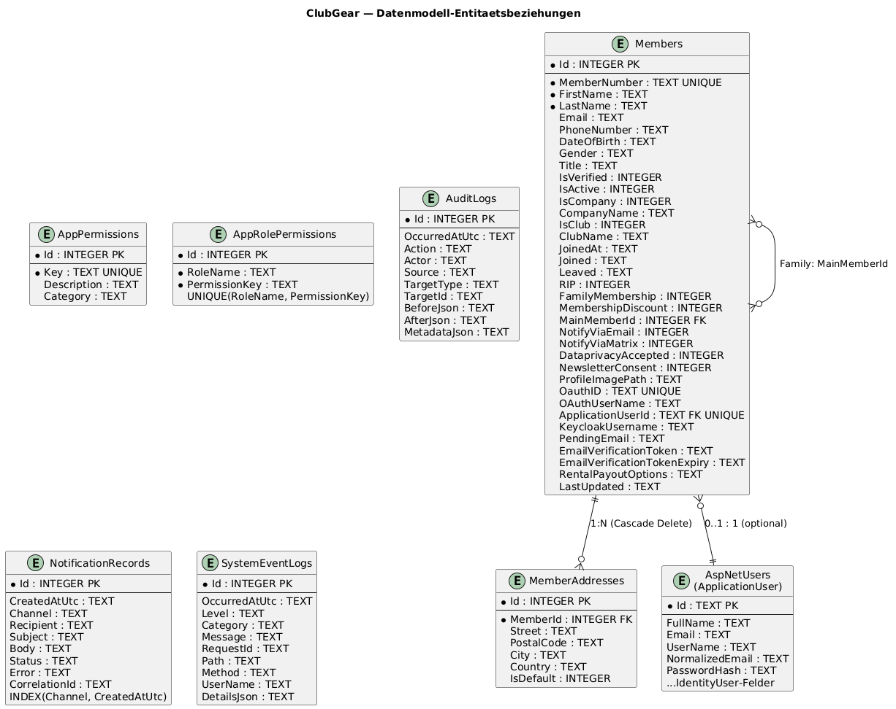

# Data Model And Migrations

Audience: Entwickler, DBA, DevOps
Scope: Datenbankschema, Entitäten, Constraints, Legacy-Kompatibilitätsstrategie (ClubManager → ClubGear)
Last-Validated: 2026-05-31
Source-Commit: d7ff893
Related-Diagrams: diagrams/img/cmp-data-model-relations.png

## Purpose

Dokumentiert das vollständige Datenbankschema von ClubGear: alle Tabellen, Spalten,
Constraints, Indizes und die Strategie für Schema-Upgrades von Legacy-Datenbanken
(ClubManager v0.2 → ClubGear).

---

## Entitäten-Beziehungsdiagramm



---

## Schema-Verwaltungsstrategie

> **Kein EF Migrations-Ordner** — ClubGear nutzt `Database.EnsureCreatedAsync()` + manuelles Schema-Patching.
> Bei neuen Deployments wird das Schema einmalig erstellt. Für bestehende DBs werden
> via `ALTER TABLE ... ADD COLUMN IF NOT EXISTS` fehlende Spalten ergänzt.

### Zuständigkeit: `ApplicationSeeder`

```
SeedAsync()
	└─ EnsureCreatedAsync()                    ← Erstellt alle Tabellen (neu)
	└─ EnsureSqliteSchemaCompatibilityAsync()  ← Patcht bestehende Schemas
			 ├─ EnsureMembersColumnsAsync()        ← Alle ClubGear-Spalten ergänzen
			 ├─ EnsureMemberAddressesTableAsync()  ← Tabelle erzeugen falls fehlt
			 └─ EnsureLegacyDataMappingAsync()     ← Altdaten migrieren
```

---

## Tabellen

### Members

**EF-Mapping:** `ApplicationDbContext.Members`
**Entity:** `Models/Member.cs`

| Spalte | Typ | Pflicht | Constraint | Beschreibung |
|---|---|---|---|---|
| `Id` | INTEGER | ✓ | PK, Auto-Increment | Primärschlüssel |
| `MemberNumber` | TEXT(30) | ✓ | UNIQUE | Mitgliedsnummer (z.B. `M-0042`) |
| `FirstName` | TEXT(100) | ✓ | | Vorname |
| `LastName` | TEXT(100) | ✓ | | Nachname |
| `Title` | TEXT(50) | | | Anrede/Titel |
| `Email` | TEXT(255) | | | E-Mail-Adresse |
| `PhoneNumber` | TEXT(50) | | | Telefonnummer |
| `DateOfBirth` | TEXT | | | Geburtsdatum (ISO 8601) |
| `Gender` | TEXT(30) | | | Geschlecht |
| `IsVerified` | INTEGER | ✓ | DEFAULT 0 | Mitglied verifiziert |
| `IsActive` | INTEGER | ✓ | DEFAULT 1 | Aktiv-Status |
| `IsCompany` | INTEGER | ✓ | DEFAULT 0 | Firmenmitglied |
| `CompanyName` | TEXT(200) | | | Firmenname (wenn IsCompany) |
| `IsClub` | INTEGER | ✓ | DEFAULT 0 | Vereinsmitglied |
| `ClubName` | TEXT(200) | | | Vereinsname (wenn IsClub) |
| `JoinedAt` | TEXT | ✓ | DEFAULT UTC | Beitrittszeitpunkt (technisch) |
| `Joined` | TEXT | | | Beitrittsdatum (angezeigt) |
| `Leaved` | TEXT | | | Austrittsdatum |
| `RIP` | INTEGER | ✓ | DEFAULT 0 | Verstorben-Markierung |
| `FamilyMembership` | INTEGER | ✓ | DEFAULT 0 | Familienmitgliedschaft |
| `MembershipDiscount` | INTEGER | | | Rabatt in % |
| `MainMemberId` | INTEGER | | FK → Members.Id | Hauptmitglied (Familienmitglieder) |
| `NotifyViaEmail` | INTEGER | ✓ | DEFAULT 0 | E-Mail-Benachrichtigung aktiv |
| `NotifyViaMatrix` | INTEGER | ✓ | DEFAULT 0 | Matrix-Benachrichtigung aktiv |
| `DataprivacyAccepted` | INTEGER | ✓ | DEFAULT 0 | DSGVO-Zustimmung |
| `NewsletterConsent` | INTEGER | ✓ | DEFAULT 0 | Newsletter-Einwilligung |
| `ProfileImagePath` | TEXT(255) | | | Pfad zum Profilbild |
| `OauthID` | TEXT(100) | | UNIQUE | OAuth2/OIDC Subject-ID |
| `OAuthUserName` | TEXT(100) | | | OAuth-Benutzername |
| `ApplicationUserId` | TEXT(100) | | UNIQUE, FK → AspNetUsers.Id | Verknüpfter ASP.NET Identity User |
| `KeycloakUsername` | TEXT(255) | | | Keycloak-Benutzername |
| `PendingEmail` | TEXT(255) | | | Ausstehende E-Mail-Änderung |
| `EmailVerificationToken` | TEXT(255) | | | Token für E-Mail-Verifikation |
| `EmailVerificationTokenExpiry` | TEXT | | | Ablaufzeitpunkt des Tokens |
| `RentalPayoutOptions` | TEXT(2000) | | | Auszahlungs-JSON (z.B. für Mietoptionen) |
| `InitPassword` | TEXT(255) | | | Initiales Passwort (temporär) |
| `LastUpdated` | TEXT | | | Letztes Update-Datum |

**Indizes:**
- `UNIQUE(MemberNumber)` — eindeutige Mitgliedsnummer
- `UNIQUE(ApplicationUserId)` — 1:1-Verknüpfung mit Identity-User
- `UNIQUE(OauthID)` — eindeutige OAuth-ID

**Computed Property (keine DB-Spalte):**
- `FullName` — gibt `CompanyName`, `ClubName` oder `"FirstName LastName"` zurück (je nach Typ)

---

### MemberAddresses

**EF-Mapping:** `ApplicationDbContext.MemberAddresses`
**Entity:** `Models/MemberAddress.cs`

| Spalte | Typ | Pflicht | Constraint | Beschreibung |
|---|---|---|---|---|
| `Id` | INTEGER | ✓ | PK | Primärschlüssel |
| `MemberId` | INTEGER | ✓ | FK → Members.Id (CASCADE DELETE) | Zugehöriges Mitglied |
| `Street` | TEXT(255) | | | Straße + Hausnummer |
| `PostalCode` | TEXT(20) | | | Postleitzahl |
| `City` | TEXT(100) | | | Stadt |
| `Country` | TEXT(100) | | | Land |
| `IsDefault` | INTEGER | ✓ | DEFAULT 0 | Standardadresse |

**Beziehung:** `Member` 1 → N `MemberAddresses` (EF Cascade Delete konfiguriert)

---

### AspNetUsers (ApplicationUser)

**EF-Mapping:** geerbt von `IdentityDbContext<ApplicationUser>`
**Entity:** `Models/ApplicationUser.cs` (extends `IdentityUser`)

Zusätzliche Spalte gegenüber Standard-Identity:

| Spalte | Typ | Beschreibung |
|---|---|---|
| `FullName` | TEXT | Anzeigename des Users |

---

### AppPermissions

**EF-Mapping:** `ApplicationDbContext.Permissions`

| Spalte | Typ | Constraint | Beschreibung |
|---|---|---|---|
| `Id` | INTEGER | PK | |
| `Key` | TEXT | UNIQUE | Permission-Schlüssel (z.B. `members.read`) |
| `Description` | TEXT | | Beschreibung |
| `Category` | TEXT | DEFAULT `"General"` | Gruppierung |

---

### AppRolePermissions

**EF-Mapping:** `ApplicationDbContext.RolePermissions`

| Spalte | Typ | Constraint | Beschreibung |
|---|---|---|---|
| `Id` | INTEGER | PK | |
| `RoleName` | TEXT | UNIQUE(RoleName, PermissionKey) | Rollenname |
| `PermissionKey` | TEXT | UNIQUE(RoleName, PermissionKey) | Permission-Key |

---

### AuditLogs

**EF-Mapping:** `ApplicationDbContext.AuditLogs`
**Entity:** `Models/AuditLogEntry.cs`

| Spalte | Typ | Beschreibung |
|---|---|---|
| `Id` | INTEGER (long) | PK |
| `OccurredAtUtc` | TEXT | Zeitstempel (UTC) |
| `Action` | TEXT | Aktion (z.B. `"Member.Update"`) |
| `Actor` | TEXT | Auslösender Benutzer |
| `Source` | TEXT | Service/Komponente |
| `TargetType` | TEXT | Betroffener Entity-Typ |
| `TargetId` | TEXT | Betroffene Entity-ID |
| `BeforeJson` | TEXT | JSON-Snapshot vor Änderung |
| `AfterJson` | TEXT | JSON-Snapshot nach Änderung |
| `MetadataJson` | TEXT | Zusätzliche Metadaten |

---

### NotificationRecords

**EF-Mapping:** `ApplicationDbContext.NotificationRecords`
**Entity:** `Models/NotificationRecord.cs`

| Spalte | Typ | Beschreibung |
|---|---|---|
| `Id` | INTEGER (long) | PK |
| `CreatedAtUtc` | TEXT | Erstellungszeitpunkt |
| `Channel` | TEXT | Kanal (`"Email"`, `"Matrix"`) |
| `Recipient` | TEXT | Empfänger |
| `Subject` | TEXT | Betreff |
| `Body` | TEXT | Nachrichteninhalt |
| `Status` | TEXT | `"Queued"`, `"Sent"`, `"Failed"` |
| `Error` | TEXT | Fehlermeldung (falls Failed) |
| `CorrelationId` | TEXT | Korrelations-ID für Tracing |

**Index:** `(Channel, CreatedAtUtc)` für effiziente Kanal-Abfragen

---

### SystemEventLogs

**EF-Mapping:** `ApplicationDbContext.SystemEventLogs`
**Entity:** `Models/SystemEventLog.cs`

| Spalte | Typ | Beschreibung |
|---|---|---|
| `Id` | INTEGER (long) | PK |
| `OccurredAtUtc` | TEXT | Zeitstempel |
| `Level` | TEXT | `"Info"`, `"Warning"`, `"Error"` |
| `Category` | TEXT | `"Application"`, `"Security"`, etc. |
| `Message` | TEXT | Log-Nachricht |
| `RequestId` | TEXT | HTTP-Request-ID |
| `Path` | TEXT | Request-Pfad |
| `Method` | TEXT | HTTP-Methode |
| `UserName` | TEXT | Eingeloggter Benutzer |
| `DetailsJson` | TEXT | Zusätzliche Details als JSON |

---

## Legacy-Kompatibilität: ClubManager v0.2 → ClubGear

ClubManager-Datenbanken fehlen zahlreiche in ClubGear neu eingeführte Spalten.
`ApplicationSeeder.EnsureSqliteSchemaCompatibilityAsync()` patcht diese beim Start:

### Phase 1 — Fehlende Spalten ergänzen (`EnsureMembersColumnsAsync`)

Alle ClubGear-spezifischen Spalten werden via `ALTER TABLE Members ADD COLUMN ...`
idempotent ergänzt, falls sie noch nicht existieren.

### Phase 2 — Daten-Mapping (`EnsureLegacyDataMappingAsync`)

| Legacy-Spalte | ClubGear-Spalte | Mapping-Logik |
|---|---|---|
| `IsNotVerifyed` | `IsVerified` | `IsVerified = NOT IsNotVerifyed` (invertierte Semantik) |
| `MembershipNumber` | `MemberNumber` | Direktkopie |
| *(fehlt)* | `MemberNumber` | Auto-Generierung: `'M-' || printf('%04d', Id)` |
| *(fehlt)* | `FirstName` | Fallback: `'Mitglied'` |
| *(fehlt)* | `LastName` | Fallback: `Id` als String |
| *(fehlt)* | `JoinedAt` | Fallback: Aktuelles UTC-Datum |
| `PhoneNumbers`-Tabelle | `PhoneNumber` | Erste Nummer aus Legacy-Tabelle kopiert |
| `Addresses`-Tabelle | `MemberAddresses` | Alle Adressen nach `MemberAddresses` migriert |

### Phase 3 — MemberAddresses-Tabelle (`EnsureMemberAddressesTableAsync`)

```sql
CREATE TABLE IF NOT EXISTS MemberAddresses (
		Id INTEGER PRIMARY KEY AUTOINCREMENT,
		MemberId INTEGER NOT NULL,
		Street TEXT, PostalCode TEXT, City TEXT, Country TEXT,
		IsDefault INTEGER NOT NULL DEFAULT 0,
		FOREIGN KEY (MemberId) REFERENCES Members(Id) ON DELETE CASCADE
)
```

Alle Migrationen sind **idempotent** — mehrfaches Ausführen führt nicht zu Fehlern.

---

## Open Questions
- `RentalPayoutOptions`: JSON-Struktur noch nicht standardisiert — aktuell freitext.
- `InitPassword`: Wird temporär gesetzt und sollte nach erstem Login gelöscht werden — kein automatischer Cleanup implementiert.
- Migration von `AspNetRoles` bei Legacy-DB: Rollen werden vom Seeder neu angelegt, aber bestehende Identity-User haben ggf. keine Rollenzuordnung.

## References
- [Core Deep-Dive](core-deep-dive.md)
- [Runtime & Deployment](runtime-deployment.md)
- [Legacy-Kompatibilitätsdokumentation](member-legacy-compatibility.md)
- [Diagrammquelle](diagrams/src/cmp-data-model-relations.puml)
