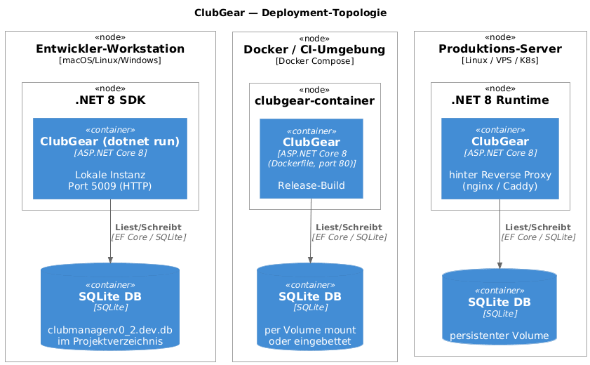
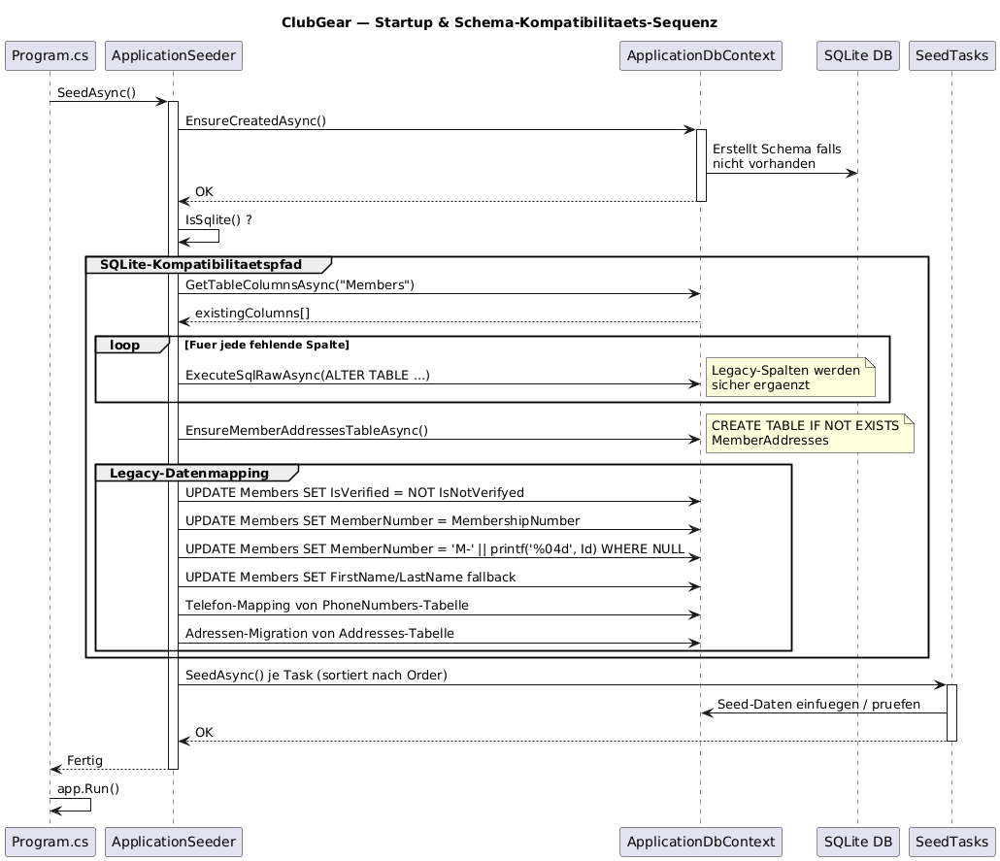

# Runtime & Deployment

Audience: DevOps, Entwickler, Systemadmins
Scope: Laufzeitverhalten, Hosting-Konfiguration, Startup-Sequenz, Deployment-Topologie
Last-Validated: 2026-07-09
Source-Commit: working-tree docs refresh
Related-Diagrams: diagrams/img/dep-runtime-deployment.png, diagrams/img/seq-startup-migration-compatibility.png

## Purpose

Dokumentiert, wie ClubGear gestartet, konfiguriert und betrieben wird —
von der lokalen Entwicklungsumgebung bis zum produktiven Container-Deployment.

---

## Deployment-Topologie



### Umgebungen

| Umgebung | Startmethode | Datenbankdatei | Port |
|---|---|---|---|
| **Development** | `dotnet run --launch-profile http` | `clubmanagerv0_2.dev.db` | 5007 (HTTP) |
| **Docker/CI** | `docker compose up` | per Volume-Mount (konfigurierbar) | 80 |
| **Produktion** | `dotnet run` / Container hinter Reverse-Proxy | persistenter Volume | 443 (via nginx/Caddy) |

Der Umgebungs-Switch erfolgt über die `ASPNETCORE_ENVIRONMENT`-Umgebungsvariable.
Im Dev-Profil werden `appsettings.Development.json` + User Secrets geladen.

### macOS-Entwicklung

Fuer lokale `dotnet run`-Starts ist `UseAppHost=false` gesetzt. Dadurch startet ClubGear in der Entwicklung ohne nativen AppHost, was auf macOS wiederkehrende Gatekeeper-/Quarantine-Popups auf dem generierten `ClubGear`-Binary vermeidet.

Falls ein bereits gebautes Binary oder native Abhaengigkeiten wie `libe_sqlite3.dylib` dennoch mit `com.apple.quarantine` markiert wurden, hilft lokal:

```bash
xattr -dr com.apple.quarantine bin/Debug/net8.0
find bin/Debug/net8.0 -type f \( -name 'ClubGear' -o -name '*.dylib' \) -print0 \
  | xargs -0 -I{} codesign --force --sign - '{}'
```

---

## Startup-Sequenz & Schema-Kompatibilität



### Ablauf (`Program.cs` → `ApplicationSeeder`)

```
1. WebApplication.CreateBuilder(args)
2. Dienste registrieren (DI via ServiceCollectionExtensions)
3. app.Build()
4. await seeder.SeedAsync()
   ├── EnsureCreatedAsync()        ← Erstellt Schema falls neu
   ├── EnsureSqliteSchemaCompatibilityAsync()
   │   ├── Fehlende Spalten ergänzen (ALTER TABLE)
   │   ├── MemberAddresses- und SystemConfig-Tabellen sicherstellen
   │   ├── Plugin-Status, Plugin-Abhaengigkeiten und MembershipType-Schema patchen
   │   ├── Sub-Member-Hierarchy-Spalten patchen und Default-Container backfillen
   │   └── Legacy-Datenmapping (IsNotVerifyed → IsVerified, etc.)
   └── SeedTasks ausführen (IRoleSeeder, IPermissionSeeder, …)
5. app.Run()
```

> **Kein EF-Migrations-Ordner** — ClubGear verwendet `EnsureCreated` + manuelles
> Schema-Patching. Migrations werden durch `ApplicationSeeder` ersetzt.
> Mehr Details: [Data Model & Migrations](data-model-and-migrations.md).

### Middleware-Pipeline (Reihenfolge)

```csharp
app.UseHttpsRedirection();
app.UseStaticFiles();
app.UseRouting();
app.UseAuthentication();
app.UseAuthorization();
app.UseMiddleware<GlobalExceptionMiddleware>();
app.MapControllerRoute(...);
app.MapRazorPages();
```

`GlobalExceptionMiddleware` liegt **hinter** Auth — unbehandelte Exceptions werden
zentral geloggt und in eine User-friendly Fehlerseite überführt.

---

## Konfigurationsdateien

| Datei | Zweck |
|---|---|
| `appsettings.json` | Produktions-Defaults (DB-Pfad, Logging, EmailSettings) |
| `appsettings.Development.json` | Dev-Overrides (Dev-DB-Pfad, Debug-Logging) |
| `Properties/launchSettings.json` | VS/CLI Startprofile (Ports, Env-Variablen) |
| `docker-compose.yml` | Container-Konfiguration mit Port-Mapping und Volume |
| `Dockerfile` | Multi-Stage-Build (restore → build → publish → runtime) |

### Relevante Konfigurationsschlüssel

```json
{
  "ConnectionStrings": {
    "DefaultConnection": "Data Source=clubmanagerv0_2.db"
  },
  "EmailSettings": {
    "SmtpHost": "...",
    "SmtpPort": 587,
    "FromAddress": "..."
  },
  "Plugins": {
    "Directory": "plugins/"
  }
}
```

---

## Docker-Betrieb

```bash
# Lokal mit docker compose starten
docker compose up --build

# Direkt als Image
docker build -t clubgear:latest .
docker run -p 8080:80 \
  -v $(pwd)/data:/app/data \
  -e ASPNETCORE_ENVIRONMENT=Production \
  clubgear:latest
```

Das `Dockerfile` verwendet einen **Multi-Stage-Build**:
1. `mcr.microsoft.com/dotnet/sdk:8.0` — Restore + Build + Publish
2. `mcr.microsoft.com/dotnet/aspnet:8.0` — Runtime-Image (kein SDK-Overhead)

---

## Open Questions
- Persistenz-Strategie bei Container-Neustarts: Volume-Mount obligatorisch — aktuell kein automatisches Backup.
- Health-Check-Endpoint: noch nicht implementiert (geplant als `/health`).

## References
- [System Overview](system-overview.md)
- [Core Deep-Dive](core-deep-dive.md)
- [Data Model & Migrations](data-model-and-migrations.md)
- [Diagrammquelle Deployment](diagrams/src/dep-runtime-deployment.puml)
- [Diagrammquelle Startup-Sequenz](diagrams/src/seq-startup-migration-compatibility.puml)
