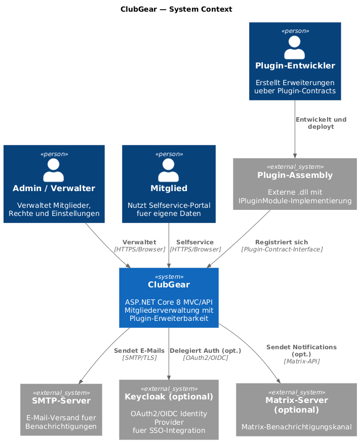

# System Overview

Audience: Entwickler, Architekten, technisch versierte Vereinsadmins
Scope: Gesamtsystem ClubGear — Kontextgrenzen, Akteure, externe Systeme
Last-Validated: 2026-06-07
Source-Commit: ae195e7
Related-Diagrams: diagrams/img/ctx-system-overview.png

## Purpose

Dieses Dokument beschreibt ClubGear auf Systemkontextebene (C4 Level 1).
Es klärt, welche Akteure das System nutzen, welche externen Systeme interagieren
und wie ClubGear intern strukturiert ist (MVC-Core + Plugin-Erweiterbarkeit).

## Systemkontext



### Akteure

| Akteur | Rolle |
|---|---|
| **Admin / Verwalter** | Verwaltet Mitglieder, Rollen, Berechtigungen und Einstellungen über die Web-Oberfläche |
| **Mitglied** | Nutzt das Selfservice-Portal (`/SelfService`) zur Pflege eigener Profildaten und plugin-getriebener Erweiterungen |
| **Plugin-Entwickler** | Erstellt Erweiterungen, die über `IPluginModule` ins System registriert werden |

### Externe Systeme

| System | Verbindung | Pflicht |
|---|---|---|
| SMTP-Server | Ausgehende E-Mails (Notifications, Registrierung) | Ja (konfigurierbar) |
| Keycloak (optional) | OAuth2/OIDC SSO-Integration | Nein |
| Matrix-Server (optional) | Benachrichtigungen via Matrix-Protokoll | Nein |
| Plugin-Assemblies | `.dll`-Dateien mit `IPluginModule`-Implementierung | Nein |

## Systemgrenzen

ClubGear ist eine **Monolith-MVC-Anwendung** mit eingebettetem API-Layer.
Es gibt **keine Microservices** — alle Features laufen im selben Prozess.

```
Browser → ASP.NET Core (MVC-Controller + API-Controller)
              ↓
         Service-Layer (Feature-Services, Core-Services)
              ↓
         EF Core → SQLite-Datenbank
```

Der Plugin-Mechanismus erlaubt externe Module, die beim Start über
`IPluginInstallerService` installiert, über den Lifecycle aktiviert und beim Start in die Runtime geladen werden.
Plugins **dürfen nicht** direkt auf `ApplicationDbContext` zugreifen — sie erhalten
dedizierte Facades und Contribution-Slots fuer Member-Ansichten, Selfservice und Admin/Functions.

## Berechtigungskonzept

ClubGear verwendet ein datenbankgestütztes Berechtigungssystem:
- Rollen → `AppRolePermission`-Tabelle
- Permissions → `AppPermission`-Tabelle
- Zugriffskontrolle via `[PermissionAuthorize(PermissionKeys.XXX)]`-Attribute

Vordefinierte Rollen: `Admin`, `Member`, `SelfService` (→ `RoleNames.cs`, `CorePermissionDefinitionProvider.cs`).

## Technologie-Stack

| Schicht | Technologie |
|---|---|
| Framework | ASP.NET Core 8 MVC |
| Datenbank | SQLite über EF Core 8 |
| UI | Razor Views, Bootstrap 5.3, Bootstrap Icons 1.11 |
| Auth | ASP.NET Core Identity |
| Tests | xUnit (ArchitectureTests) |
| Container | Docker (Dockerfile + docker-compose.yml) |

## Open Questions
- SSO-Integration via Keycloak: aktuell optional, Rollout-Datum unbekannt.
- Matrix-Notifications: Feature vorhanden, aber nicht in der Default-Konfiguration aktiviert.

## References
- [Runtime & Deployment](runtime-deployment.md)
- [Core Deep-Dive](core-deep-dive.md)
- [Plugin Boundary & Compliance](plugin-boundary-and-compliance.md)
- [Diagrammquelle](diagrams/src/ctx-system-overview.puml)
