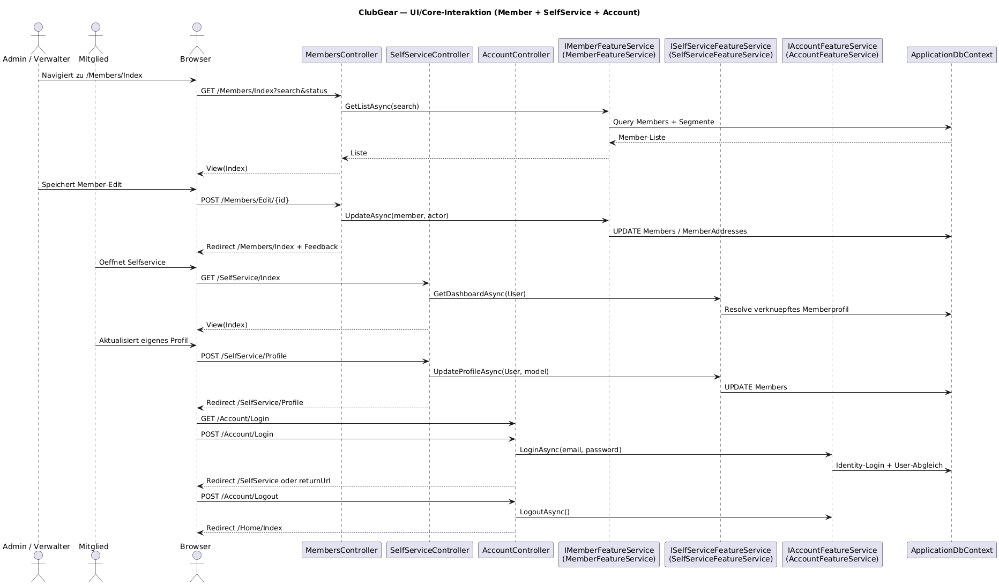

# Ui Flow Map

Audience: Entwickler, UI-Verantwortliche, QA
Scope: End-to-End-UI-Flows, Route/Controller-Mapping, View-Integration
Last-Validated: 2026-06-07
Source-Commit: ae195e7
Related-Diagrams: diagrams/img/seq-ui-core-interaction.png

## Purpose

Dieses Dokument beschreibt die wichtigsten Nutzerfluesse in ClubGear auf
Route-, Controller- und View-Ebene. Der Fokus liegt auf nachvollziehbaren
Pfaden vom Benutzerereignis bis zum Core-Service.

---

## UI-Core-Interaktion

---

## Hauptfluesse

### Mitgliederverwaltung

| Nutzeraktion | Route | Controller | View | Core-Service |
|---|---|---|---|---|
| Mitgliederliste anzeigen | `GET /Members/Index` | `MembersController.Index` | `Views/Members/Index.cshtml` | `IMemberFeatureService.GetListAsync()` |
| Filter anwenden | `POST /Members/Index` | `MembersController.Index` | `Views/Members/_SearchAndFilters.cshtml` | Redirect mit Query-String |
| Mitglied anlegen | `GET/POST /Members/Create` | `MembersController.Create` | `Views/Members/Create.cshtml` | `CreateAsync()` |
| Mitglied bearbeiten | `GET/POST /Members/Edit/{id}` | `MembersController.Edit` | `Views/Members/Edit.cshtml` | `UpdateAsync()` |
| Mitglied verifizieren | `POST /Members/Verify/{id}` | `MembersController.Verify` | Aktion ohne eigene View | `VerifyAsync()` |
| Mitglied loeschen | `POST /Members/Delete/{id}` | `MembersController.Delete` | Aktion ohne eigene View | `DeleteAsync()` |
| CSV importieren | `GET/POST /Members/Import` | `MembersController.Import` | `Views/Members/Import.cshtml` | `ImportCsvAsync()` |
| Inaktive loeschen | `GET/POST /Members/BulkDeleteTerminatedMembers` | `MembersController.BulkDeleteTerminatedMembers` | `Views/Members/Index.cshtml` + Bulk-Area | `BulkDeleteAsync()` |
| Plugin-Aktion fuer Mitglied ausfuehren | `POST /api/member/plugin-actions` | `MemberApiController.ExecutePluginAction` | `_HeaderActions` + `_PluginActionModal` | `IMemberPluginSlotService`, `IPluginRuntimeAdapter` |
| Plugin-Erweiterungen im Edit anzeigen | `GET /Members/Edit/{id}` | `MembersController.Edit` | `Views/Members/Edit.cshtml` + `_HeaderActions` + `_PluginSlots` | `IMemberPluginSlotService` |

### Selfservice

| Nutzeraktion | Route | Controller | View | Core-Service |
|---|---|---|---|---|
| Selfservice-Dashboard oeffnen | `GET /SelfService/Index` | `SelfServiceController.Index` | `Views/SelfService/Index.cshtml` | `GetDashboardAsync()` |
| Eigenes Profil anzeigen | `GET /SelfService/Profile` | `SelfServiceController.Profile` | `Views/SelfService/Profile.cshtml` | `GetProfileAsync()` |
| Eigenes Profil speichern | `POST /SelfService/Profile` | `SelfServiceController.Profile` | `Views/SelfService/Profile.cshtml` | `UpdateProfileAsync()` |
| Plugin-Slots im Profil anzeigen | `GET /SelfService/Profile` | `SelfServiceController.Profile` | `Views/SelfService/Profile.cshtml` + `_PluginSlots` + `_PluginActionModal` | `IMemberPluginSlotService` |
| Plugin-Aktion im Selfservice ausfuehren | `POST /api/self-service/plugin-actions` | `SelfServiceApiController.ExecutePluginAction` | `Views/SelfService/Profile.cshtml` + `_PluginActionModal` | `IMemberPluginSlotService`, `IPluginRuntimeAdapter` |

### Authentifizierung

| Nutzeraktion | Route | Controller | View | Core-Service |
|---|---|---|---|---|
| Login-Seite | `GET /Account/Login` | `AccountController.Login` | `Views/Account/Login.cshtml` | keine direkte Aktion |
| Login ausfuehren | `POST /Account/Login` | `AccountController.Login` | `Views/Account/Login.cshtml` | `LoginAsync()` |
| Registrierung | `GET/POST /Account/Register` | `AccountController.Register` | `Views/Account/Register.cshtml` | `RegisterAsync()` |
| Logout | `POST /Account/Logout` | `AccountController.Logout` | keine eigene View | `LogoutAsync()` |

### Plugin-/Admin-Fluesse

| Nutzeraktion | Route | Controller | Output |
|---|---|---|---|
| Plugin-Administration anzeigen | `GET /PluginAdmin` | `PluginAdminController.Index` | MVC |
| Plugin-Panels in Admin/Functions laden | `GET /api/admin/plugin-commands/panels` | `PluginAdminCommandsController.GetPanels` | JSON |
| Plugin-Panel-Befehl ausfuehren | `POST /api/admin/plugin-commands` | `PluginAdminCommandsController.Execute` | JSON |
| Installierte Plugins listen | `GET /api/plugins/installed` | `PluginsController.GetInstalled` | JSON |
| Plugin aus Marketplace installieren | `POST /api/plugins/install/marketplace` | `PluginsController.InstallFromMarketplace` | JSON |
| Plugin-ZIP installieren | `POST /api/plugins/install/zip` | `PluginsController.InstallFromZip` | JSON |
| Plugin aktivieren | `POST /api/plugins/{moduleId}/activate` | `PluginsController.Activate` | JSON |
| Plugin deaktivieren | `POST /api/plugins/{moduleId}/deactivate` | `PluginsController.Deactivate` | JSON |
| Plugin-Route aufrufen (root) | `GET /api/plugin-runtime/{moduleId}` | `PluginRuntimeController.InvokeRootRoute` | HTTP Content |
| Plugin-Route aufrufen (Pfad) | `GET /api/plugin-runtime/{moduleId}/{**routePath}` | `PluginRuntimeController.InvokeRoute` | HTTP Content |
| Test-Notification senden | `POST /api/notifications/send-test` | `NotificationsController.SendTest` | JSON |

---

## View-Integration

Die UI folgt einem klaren Pattern:
- `Index`-Seiten tragen Filter, Listen und Bulk-Aktionen in Regionen/Partials.
- `Create`/`Edit`-Seiten verwenden Forms mit Antiforgery und ModelState-Feedback.
- Modal-fähige Aktionen (`Members/Edit`) erkennen `X-Requested-With: XMLHttpRequest`
	und geben bei Erfolg JSON statt Redirect zurück.
- `SelfService` nutzt `Challenge()` als Kontrollfluss, wenn kein Mitglied verknuepft ist.
- Plugin-Aktionen mit Argumentschema werden ueber wiederverwendbare, schema-gesteuerte Modale gerendert.
- `Admin/Functions` hostet generische Plugin-Panels; die konkrete Fachlogik bleibt im Plugin.

### Feedback-Fluss

Feedback wird ueber `ActionFeedbackViewModel` konsistent in `TempData` oder `ViewData`
transportiert, damit dieselbe Meldung nach Redirects und bei Inline-Fehlern sichtbar bleibt.

## Open Questions
- Ein Teil der UI ist bewusst modal-fähig, aber die Standard-Navigation bleibt klassisch per Full Page Load.
- Die Plugin-Laufzeitrouten sind aktuell auf GET-Dispatch ausgelegt; weitere HTTP-Methoden sind noch nicht dokumentiert.
- Browser-E2E fuer die schema-gesteuerten Plugin-Modale ist noch nicht automatisiert.

## References
- [Core Deep-Dive](core-deep-dive.md)
- [Runtime & Deployment](runtime-deployment.md)
- [Plugin Boundary & Compliance](plugin-boundary-and-compliance.md)
- [Plugin Authoring Guide](plugin-authoring-guide.md)
- [Diagrammquelle UI/Core](diagrams/src/seq-ui-core-interaction.puml)
